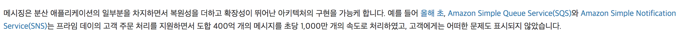
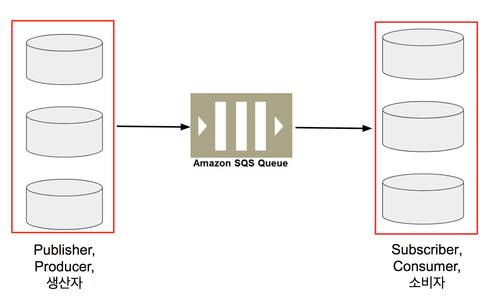

# 비동기 아키텍처

## SQS

* SQS는 [장애허용 시스템](https://ko.wikipedia.org/wiki/%EC%9E%A5%EC%95%A0_%ED%97%88%EC%9A%A9_%EC%8B%9C%EC%8A%A4%ED%85%9C) 구축의 기반이 된다.
  * 메세지 처리하던 sub이 죽어도 처리중이던 메세지는 2분 동안 큐에 남아있어, 그 사이에 다른 sub이 가져가서 처리합니다.
  * AWS
* SQS는 **적어도 1번**은 메세지 전달을 보장한다.
  * 하나의 메세지가 2번 소비될수도 있다.
  * 즉, SQS를 쓴다면 메세지의 **멱등성**을 보장해야 합니다.
      * 멱등성이란, 동일한 메세지가 반복 처리되어도 **결과가 동일하게 유지**되는것을 얘기합니다.

* SQS는 메세지의 순서를 보장하지 않는다.
  * 메세지가 **생성된 순서와 읽는 순서가 다를 수** 있습니다.
  * 
* 